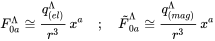

# Printed-Latex-Data-Generation

Python and JS tools for generating Printed Latex Dataset (images of tex formulas with labels) via parsing Cornell's [KDDCUP](https://www.cs.cornell.edu/projects/kddcup/datasets.html).
Also see [KDDCUP paper](https://www.cs.cornell.edu/home/kleinber/kddcup2003.pdf).


<br />

Download a prebuilt dataset 230k from [here](https://zenodo.org/record/7738969#.ZBJJSi-B2Lc).


<br />


**Note: One can use any .tar files with LaTex formulas to parse, need to manually add it to the folder.** <br />
**Parsing for ArXiv, Wikipedia and Stackexchange sources are coming.** 


## How to generate data
The easiest way to generate data is via Jupyter Notebook `Data generation.ipynb` located in folder `Jupyter Notebooks/`.
See section Generate using Jupyter Notebook Example for step-by-step instructions.


Final outpus is located in `Data` folder.

Final outputs
- folder `generated_png_images` contianing PNG images
- `corresponding_png_images.txt` each new line contains png images filename for the folder `generated_png_images`
- `final_png_formulas.txt` each new line contains a carresponing LaTex formula
- folder `raw_data` containing raw downaloded data
- folder `temporary_data` containing formulas from various stages of processing and svg images generated along the way

<br />
<br />

## How to set Hardcoded Parameters

#### 1. Set parsing formula length during parsing .tex/.tar files
In `download_data_utils.py` 
- Max formula Length in bytes (line 24) MAX_FORMULA_LENGTH_in_Bytes = 1024
- Min formula Length in bytes (line 25) MIN_FORMULA_LENGTH_BYTES = 40

#### 2. Provide different .tex/.tar files for parsing
In `configs.py` 
- (line 44)  change `metadata` to the local/remote location of your files


#### 3. Provide different .tex/.tar files for parsing
In `configs.py` 
- (line 44)  change `metadata` to the local/remote location of your files


#### 4. Add/Remove Filter-Out-Words when parsing .tex files
In `configs.py` 
- (line 42)  alter the list in  `FILTER_OUT_WORDS = ['%', r'\\label',...`


#### 5. Set DPI for generated .png images
In `svg_to_png.py` 
- (line 176) add flags `--dpi-x=96 --dpi-y=96`  with custom dpi to `png_generation_rsvg = f" rsvg-convert  --width=1024 --height=128 --dpi-x=96 --dpi-y=96` 

#### 6. Set Image sizes for generated .png images
In `svg_to_png.py` 
- (line 176) add flags `--width=1024 --height=128`  with custom dimensions to `png_generation_rsvg = f" rsvg-convert  --width=1024 --height=128 --dpi-x=96 --dpi-y=96` 


<br />
<br />

## Generate using Jupyter Notebook Example


### Step 1: Notebook Initialization

Navigate to the `Jupyter Notebooks/` directory and open the provided notebook. Execute all cells except for the function:

```python
Generate_Printed_Tex(download_tex_dataset=False,
                    generate_tex_formulas=False,
                    number_tex_formulas_to_generate=1,
                    generate_svg_images_from_tex=False,
                    generate_png_from_svg=False)
```

We will invoke this function in subsequent steps with different flags.

### Step 2: Dataset Download

Use the `Generate_Printed_Tex` function to download the LaTeX dataset. Currently, the default is the KDD CUP dataset. However, you can specify URLs to any LaTeX-containing `.tar` files in the `configs.py`.

Set only the `download_tex_dataset=True` flag, leaving the others set to `False`.


### Step 3: Extract LaTeX Formulas

With the dataset in place, process and extract LaTeX formulas:

Set only the `generate_tex_formulas=True` flag and ensure all other flags are set to `False`.

> **Note**: If `number_tex_formulas_to_generate` is less than 1001, only one `.tar` file will be parsed. For values greater than or equal to 1001, all downloaded `.tar` files will be processed.

### Step 4: Convert LaTeX to SVG

To convert preprocessed LaTeX formulas into SVG format:

1. Navigate to the `tex_to_svg.py` file.
2. Modify the constants:
    - `MAX_NUMBER_TO_RENDER = 500*1000` (determines the maximum number of SVG LaTeX formulas to render)
    - `THREADS = 8` (set to the number of CPU cores, ensure it's less than the total available cores on your system)

Then, run the `Generate_Printed_Tex` function with the `generate_svg_images_from_tex=True` flag.

### Step 5: Convert SVG to PNG

Finally, transform the SVG images into PNG format:

1. Before initiating the process, ensure you have `Inkscape` installed and accessible via the command line for MacOS. For Linux, the process will use `librsvg2`.
2. Visit the `svg_to_png.py` file and adjust the parameters:
    - `THREADS = 7` (set this to a value less than your available CPU cores)
    - `PNG_WIDTH = 512`
    - `PNG_HEIGHT = 64`

Invoke the `Generate_Printed_Tex` function with the `generate_png_from_svg=True` flag to start the conversion.


Running it will output all the data in `Data` folder.

Final outputs
- folder `generated_png_images` contianing PNG images
- `corresponding_png_images.txt` each new line contains png images filename for the folder `generated_png_images`
- `final_png_formulas.txt` each new line contains a carresponing LaTex formula

  
- folder `raw_data` containing raw downaloded data
- folder `temporary_data` containing formulas from various stages of processing and svg images generated along the way

<br />
<br />

## Generated Dataset im2latex 230k

You can download a prebuilt dataset 230k from [here](https://zenodo.org/record/7738969#.ZBJJSi-B2Lc).

Some Dataset im2latex 230k Characteristics:
- images are of varying sizes with maximum Height of 431 and maximum Width of 6816
- sizes of formulas vary from 6 to 970 (tokenized length) with distribution below


- comes with a vocabulary 230k.json of size 579, which was generated on a bigger Dataset of around 330k
- sample image:



**Note: This code is very ad-hoc and requires tinkering with the source**
<br />
<br />

## Depenencies
1. Tested with Python 3.9.7 and [Anaconda version 2021.11] (https://repo.anaconda.com/archive/Anaconda3-2021.11-Linux-x86_64.sh)
2. `pip install opencv-python`
3. `pip install smart_open`
4. For Tex to SVG [see](https://www.npmjs.com/package/tex2svg):

    `sudo apt install nodejs npm`\
    `sudo npm install --global mathjax-node-cli`
     

5. For SVG to PNG:


  Linux:
  https://ubuntu.pkgs.org/20.04/ubuntu-universe-arm64/librsvg2-bin_2.48.2-1_arm64.deb.html
  
  
  `sudo apt install librsvg2-bin`
  
  <br />

  For MacOS:
  Download [Inkscape](https://inkscape.org), also see [here](https://stackoverflow.com/questions/9853325/how-to-convert-a-svg-to-a-png-with-imagemagick) 
  
 


<br />
<br />

## Contents
- `Printed_Tex.py`
  - Main module 
- `download_data_utils.py`
  - Contains tools for downlaoding tex tars and unpacking and parisng them.
- `configs.py`
  - Contains Paths and command line script commands.
- `third_party/`
  - Contains Katex for parsing LaTex formulas
- `preprocess_formulas.py` and `preprocess_formulas.js`
  - Collection of tools for handling and parsing LaTex formulas
- `svg_to_png.py`
  - Funcitons to convert LaTex formulas to SVG images using MathJax
- `png_to_svg.py`
  - Funcitons to convert SVG images formulas to PNG images using `inkscape` for (Darwin) MacOS and `rsvg-convert` for all other systems. 
- `Data/`
  - Contains `generated_png_images/` folder, `corresponding_png_images.txt`  and `final_png_formulas.txt`. Also temporary folder `temporary_data` (formulas for various stages of processing and generated SVG images) and `raw_data` where raw data is downloaded.
- `Jupyter Notebooks`
  - Contains examples of generating data using Jupyter notebooks


<br />
<br />

Idea is based on https://github.com/Miffyli/im2latex-dataset
